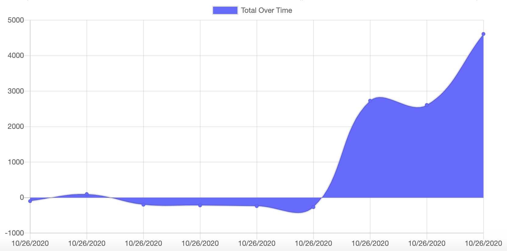

[](https://www.gnu.org/licenses/gpl-3.0)
  # Budget Tracker

  

  ## Table of Contents
  * [Description](#description)
  * [Installation](#installation)
  * [Usage](#usage)
  * [Contributing](#contributing)
  * [Tests](#tests)
  * [Questions](#questions)
  * [License](#license)

  ## Description
  I was tasked with converting an application into a progressive web app. The core principle of this PWA is that it can track a users budget input online as well as offline. The budget tracker relies on MongoDB storage when the app is online and IndexedDB to store information offline. As soon as the app is taken offline, any budget inforamtion added is stored in IndexedDB. When the app comes back online the data is passed to the Mongo database. The data persistence is achieved using a web manifest, a service worker, and a cache API. 
  ## Installation
  A package.json is included with all the necesssary dependencies and can be installed with the command ```npm i```.
  ## Usage
  The following is a link to the deployed site:
  
  [Budget Tracker](https://joseph-budget-tracker.herokuapp.com/)
  ## Contributing
  The following npm packages were used in the application: 
  * compression 
  * express 
  * lite-server 
  * mongoose 
  * morgan
  
  ## Tests
  N/A
  ## Questions
  Github profile: [dgtlctzn](https://github.com/dgtlctzn)
  
  If you have any questions about the project please contact josephperry720@gmail.com
  ## License
  This project is covered under the GNU license
